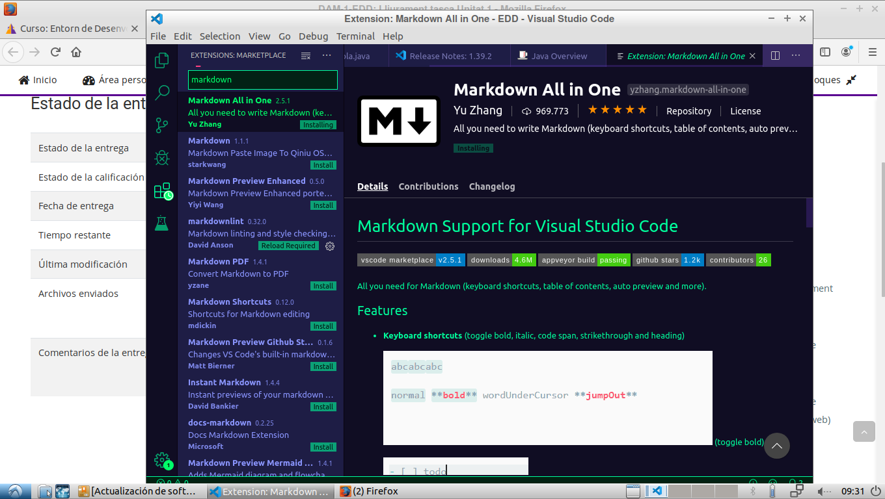
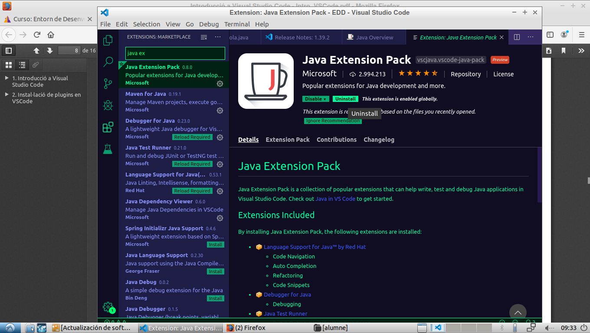
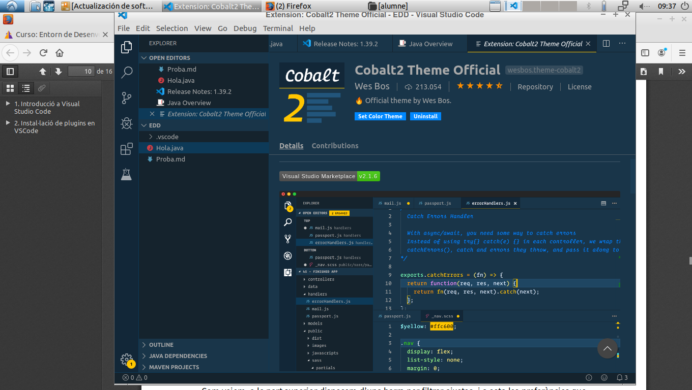

# INSTALACIÓ D'EXTENSIONS
Instalaremos estas extensiones en nuestro Visual Studio Code:
  
## -Markdown All In One

## -Java Extensions Pack

## -Tema
En nuestro caso hemos intalado el **"Cobalt"**
