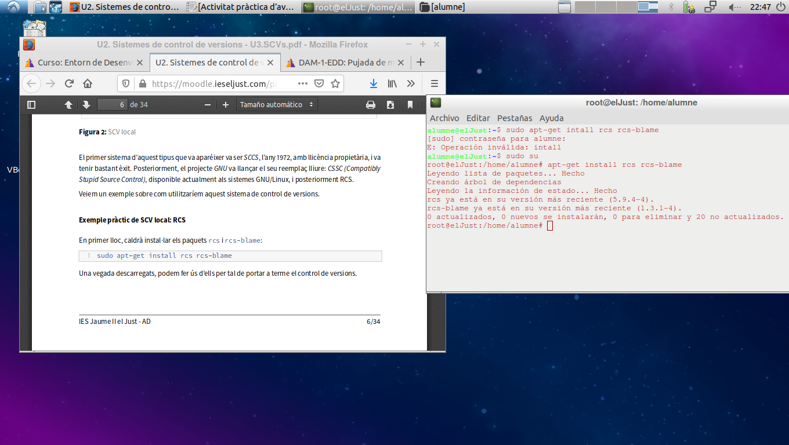
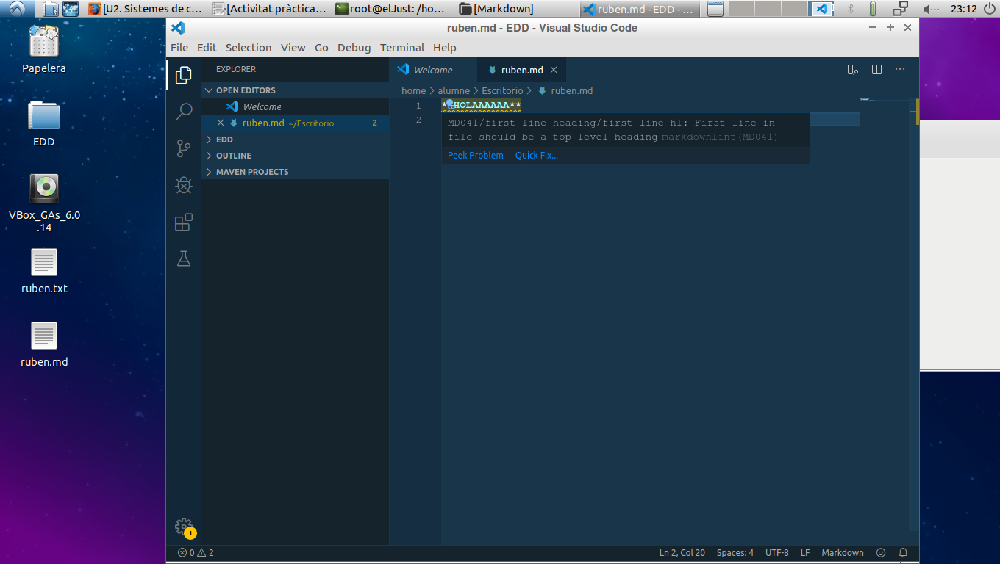
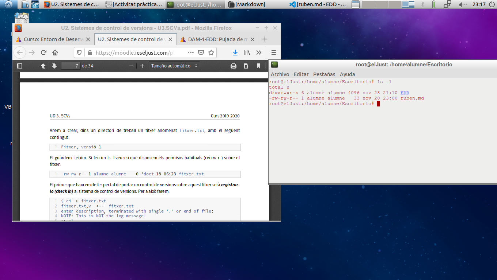
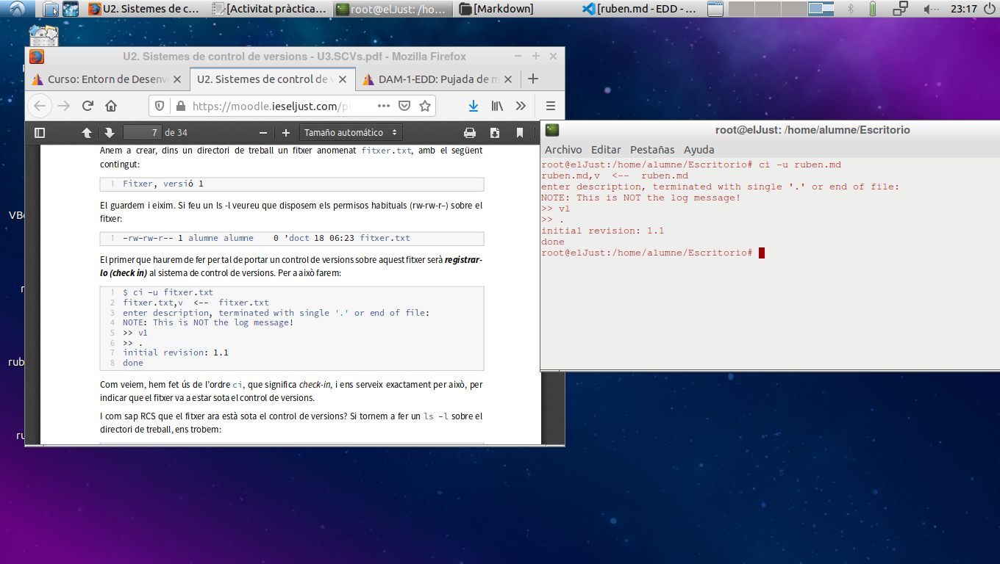
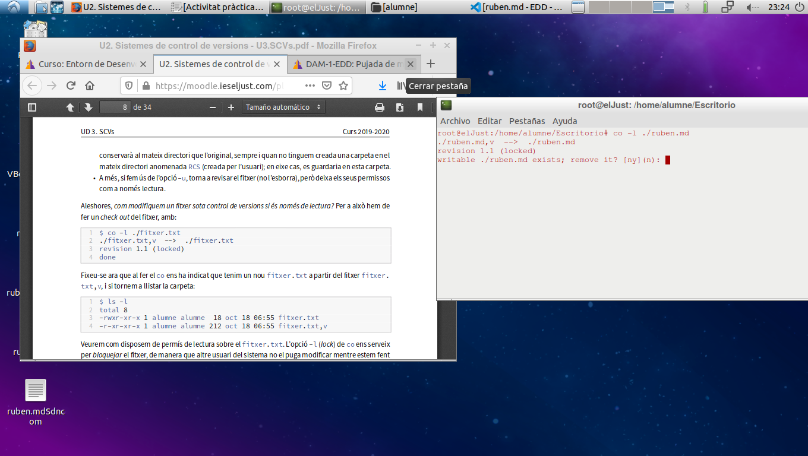
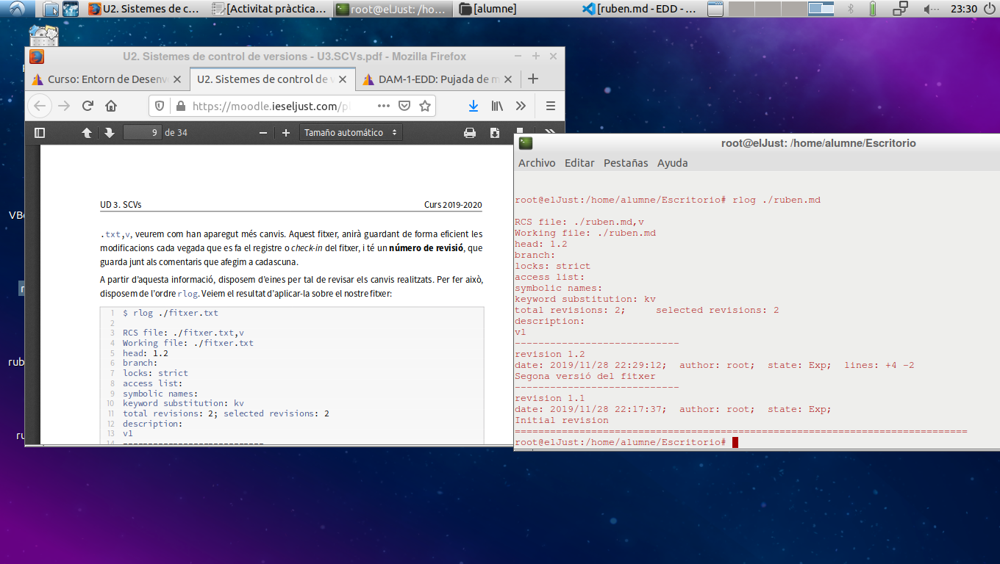
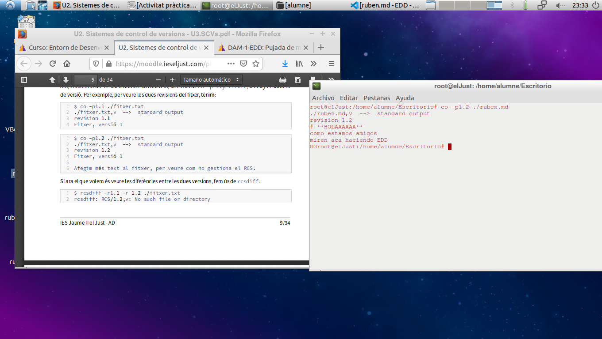
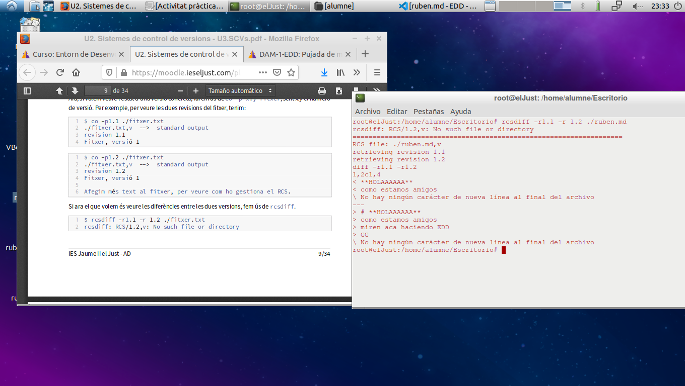

# EXERCIC RCS

### 1- Instalremos los pakcs del RCS con el comando --> "_sudo apt-get install rcs rcs-blame_"

### 2- Ahora crearemos un arhhivo, en mi caso he creado *ruben.md*, y escribiremos un par de cosas dentro de él.

### 3-Comprovarem que tinga els permisos (*rw-rw-r-*) amb un comando --> "_ls -l_"

### 4- El primer que deurem de fer per a portar un control de versions sobre el nostre fitxer, será fer un ``check in`` amb el comando --> (**ci -u ruben.md**) 

### 5- Ficarem el comando de abans per a comprobar que s'ha creat.

### 6- Ara fariem un ``check out`` amb el comando --> (**co -1 ./ruben.md**)

### 7- Una vegada fet el ``check out`` lo que farem sera modificar el nostre fitxer añadint alguna frase y tornarem a fer el comando de abans amb un ``check in``  amb el comando -->(**ci -u ruben.md**) 

### 8- Agafarem y ficarem el comando --> (**rlog ./ruben.md**), y ens mostraraels canvis que hem fet en el nostre fitxer.

### 9- El comando --> (**co -p1.1 ./ruben.md**) ens enseñara lo que s'ha guardat en la primera versió.

### 10- El comando --> (**co -p1.2 ./ruben.md**) ens enseñara lo que s'ha guardat en la segona versió.

### 11- Ara ficarem el coamndo -->(**rcsdiff -r1.1 -r1.2 ./ruben.md**) per a poder veure les diferecnies.

### 12- Ara com a ultim pas, tinguent com a ultima versio el 1.2 farem aquest comando -->(**co -r1.1 ./ruben.md**)per a que ens torne a la versio 1.1 

